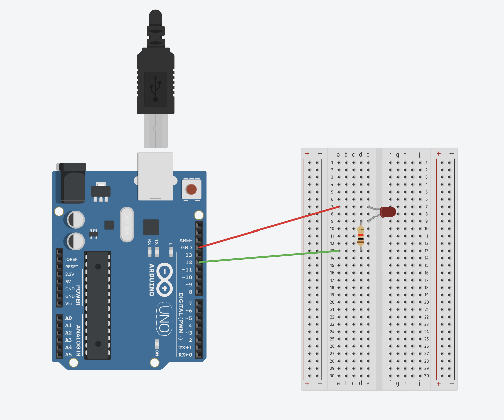

This is a very fundamental example on what arduino can do.

In this example, we will make an LED blink every second.

## Hardware Configuration

- Arduino Uno

- LED

- 220 Ohm Resistor

- Breadboard

