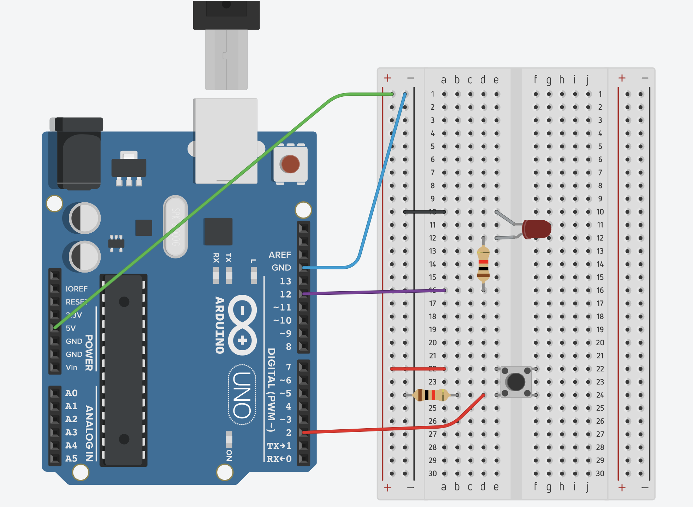

This is another basic example on what arduino can do.

In this example, we will make an LED that can be switched on and off by a button.

## Hardware Configuration

- Arduino Uno

- LED

- 220 Ohm Resistor (2x)

- Breadboard

